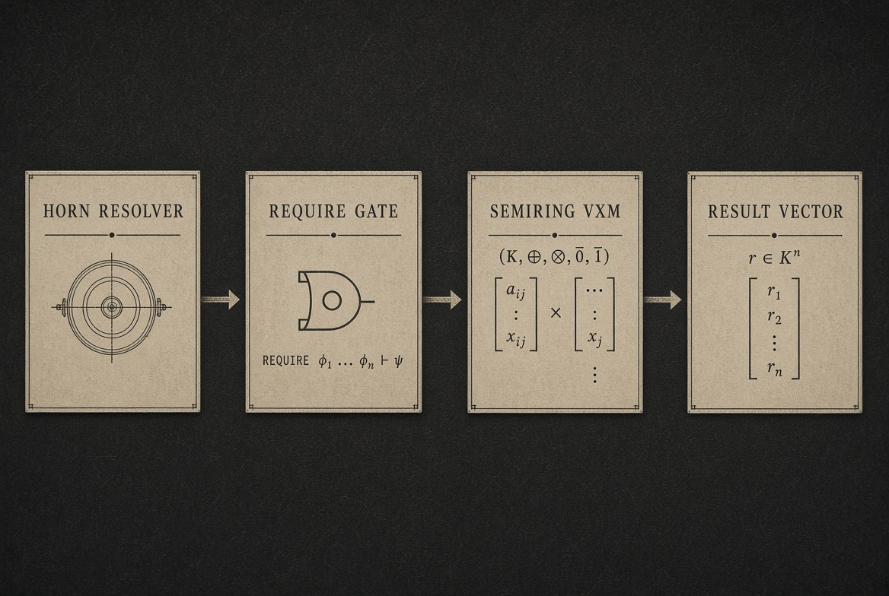
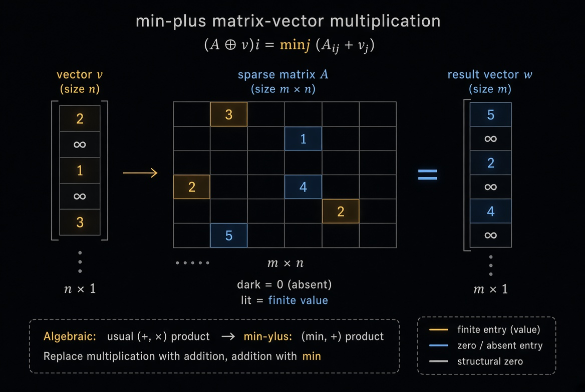
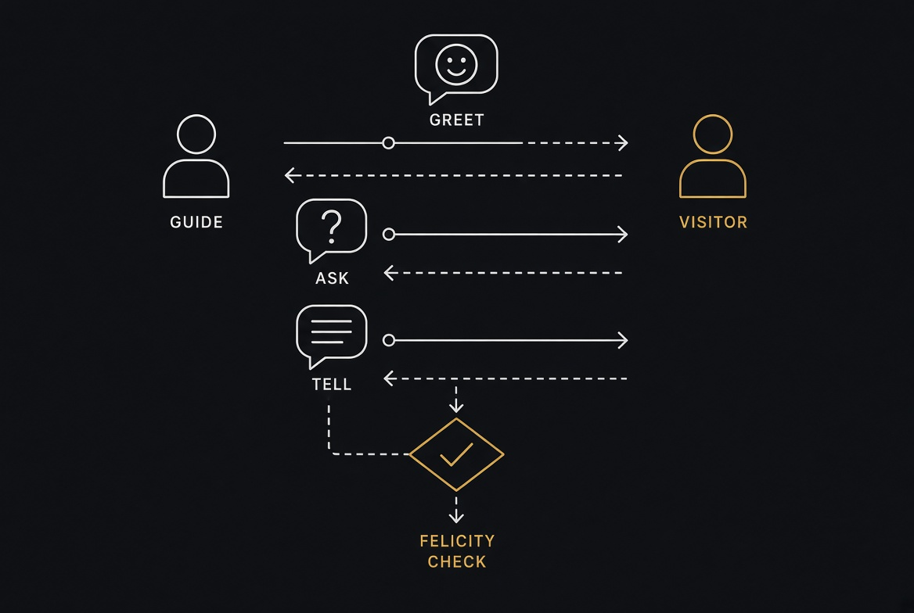

<!-- SPDX-License-Identifier: AGPL-3.0-only -->
<!-- Copyright (C) 2026 Ahmad Ali Parr. GNU Affero General Public License version 3 only. -->

# alp-harness

[](LICENSE)
[](https://github.com/AHMADALIPARR/alp-harness/actions/workflows/ci.yml)
[](https://github.com/AHMADALIPARR/alp-harness/actions/workflows/ctest.yml)
[](alp-graphblas/CMakeLists.txt)
[](lean/SpeechActs.lean)

Copyright (C) 2026 Ahmad Ali Parr.

This program is free software: you can redistribute it and/or modify it under the terms of the GNU Affero General Public License as published by the Free Software Foundation, version 3 only. This program is distributed in the hope that it will be useful, but without any warranty; without even the implied warranty of merchantability or fitness for a particular purpose. See the GNU Affero General Public License for more details. You should have received a copy of the GNU Affero General Public License along with this program. If not, see <https://www.gnu.org/licenses/>.

`SPDX-License-Identifier: AGPL-3.0-only`

There is no other license. The Apache-2.0 package that used to sit at the root was removed. The full Affero text is also in `alp-graphblas/LICENSE` because that subtree carries the FSF document. The root `LICENSE` is the version-3-only grant for the whole repository. A file with an SPDX header is under that grant. A file without a header is still under that grant. Do not add a second license notice.

This repository is a constraint harness. It is not one language, and it is not a finished product. It holds four implementations of related ideas: a C++ Horn runtime that can call ALP/GraphBLAS, a Prolog agent kernel and dialogue layer, a small Lean 4 fragment of the speech-act rules, and an IBM HLASM sketch of the resolver and the sparse product. They do not yet call each other. The C++ tests have run on GitHub Actions without the ALP library. The Prolog goals have not been run here. The Lean file has not been checked with `lake`. The assembler has not been assembled.



The diagram above is an illustration of the intended gate, not a trace from a run. A Horn resolver derives a ground atom. A REQUIRE gate admits the next step only if that derivation succeeds. A semiring vector-matrix product then runs. The result is a vector. In this tree the C++ runtime does the derivation and the closure. The assembler members `src/horn/hornres.asm` and `src/alp/require.asm` are the same idea written for z/Architecture, and they have not been assembled.

## Languages

| Language | Tree | What it is | Status |
| --- | --- | --- | --- |
| C++20 | `alp-graphblas/` | Horn runtime, parser, abduction, reference closure, optional ALP/GraphBLAS backend | CTest has passed with ALP off |
| Lean 4 | `lean/` | Finite speech-act fragment, `native_decide` on that fragment | Not built |
| Prolog | `prolog/` | Agent kernel, prime-implicate engine, dialogue, felicity | Queries not run |
| HLASM | `src/`, `jcl/` | Resolver, REQUIRE gate, sparse product | Not assembled |

## C++

The C++ project is `alp-graphblas/`. It is the only language in this repository with a configure, a build, and a test job. CMake 3.20 and a C++20 compiler are required. The default option `ALP_GRAPHBLAS_ENABLE` is on, and an on-build without an ALP install root fails at configure. The job that has passed uses the off switch.

```sh
cmake -S alp-graphblas -B build -DALP_GRAPHBLAS_ENABLE=OFF
cmake --build build -j
ctest --test-dir build --output-on-failure
```

That produces `build/alp` and the tests under `alp-graphblas/tests/`. Unification, the parser, Horn derivation, integrity, abduction, the reference graph, the integration test, and the two SNAPKITTYWEST cases are in that run. `tests/graphblas/graphblas_test.cpp` is not. It is added only when `-DALP_GRAPHBLAS_ENABLE=ON` and `-DALP_ROOT` points at an install that contains `include/graphblas.hpp`, `lib/libalp_utils`, and `lib/sequential/libgraphblas`.

The libraries are `alp_logic` and `alp_graph`. `alp_logic` is terms, atoms, clauses, unification, the parser, the knowledge base, stratification, semi-naive evaluation, SLD, abduction, integrity, provenance, and serialization. `alp_graph` is the named graph, adjacency, the fixed-point closure, the predicate bridge, and, when enabled, `src/graph/graphblas_backend.cpp`. Headers live in `alp-graphblas/include/alp/`. The Lean file is not one of them. It was moved out of that directory.

Programs are the `.alp` files in `alp-graphblas/alp/examples/` and `alp-graphblas/alp/library/`. A fact ends with a period. A rule uses `<-`. `not` is a negated body literal. `abducible` declares a predicate abduction may assume. `false <-` is an integrity constraint. The command is `build/alp`, with `--query`, `--abduce`, `--all`, `--proof`, `--graph`, and `--backend auto|reference|graphblas`. `--backend graphblas` in a binary built with the option off throws. It does not relabel the reference closure as a GraphBLAS result.

Module notes are under [The C++ modules, one by one](#the-c-modules-one-by-one) and [The graph layer](#the-graph-layer). The GitHub job is [CTest](https://github.com/AHMADALIPARR/alp-harness/actions/workflows/ctest.yml). Success there is the reference backend only.

## Lean

The Lean 4 fragment is `lean/SpeechActs.lean`. The package file is `lean/lakefile.lean`. The library name is `SpeechActs`. There are no imports. The namespace is `Dialogue`.

It is a checked slice of `prolog/speech_acts.pl`, not a translation of `prolog/dialog_kb.pl`. Agents are guide, visitor, and guard. Topics are gold, route, and threat. Acts are greet, ask, tell, clarify, deny, and ack. `force` maps those acts onto Searle's classes. `felicitous` is content, preparatory, sincerity, and essential. `reply` tells when the hearer is competent and believes the answer form, clarifies when the hearer is not competent, and denies otherwise.

The theorems are `rfl` or `native_decide` on that finite function. A guide who believes `locatedGold` gets a felicitous tell. A visitor who does not, does not. An ask about gold to the guide is a tell. An ask about threat to the guide is a clarify. Those equations do not certify the 5,441-line dialogue base.

```sh
cd lean && lake build
```

That command has not been run in this repository. A Lean 4 toolchain is required. Until `lake build` has passed, the theorems are source.

## What ALP means here

ALP is not one language. Three published systems share the initials, and this repository uses all three on purpose. Treating them as one product is the mistake the earlier Python package made.

The first is IBM Assembly Language Processor. It is the OS/2 and z/OS High Level Assembler lineage: structured assembly, CSECT, DSECT, USING, save areas, and object code for z/Architecture. The members under `src/` are written in that style. They are not a MASM program and they are not Python that prints assembler. `jcl/assemble.jcl` is an ASMA90 and IEWL job. It names `ALP.HLASM.SRC` and `SYS1.MACLIB`. Those data sets are not in this repository. Until that job has been submitted, the assembler is source.

The second is ALP/GraphBLAS, the C++17 library from Huawei Zurich. It implements the GraphBLAS algebra on semirings. A matrix-vector product is not hard-wired to ordinary arithmetic. Multiplication and addition are the semiring operations. For reachability the semiring is Boolean: or as addition, and as multiplication. For shortest paths the semiring is min-plus: addition of weights as multiplication, minimum as addition. The header the backend includes is `graphblas.hpp`. The types are `grb::Matrix`, `grb::Semiring`, and `grb::buildMatrixUnique`. That library is not vendored here. The CMake option `ALP_GRAPHBLAS_ENABLE` defaults to on, and an on-build without `ALP_ROOT` is a fatal configure error. The reference closure in `src/graph/fixed_point.cpp` is the path that runs without that library. It is the oracle, not a substitute for a production GraphBLAS build.

The third is ALPprolog, the agent language of Drescher and Thielscher. A program is a term: `nil`, `prim(A)`, `sense(A)`, `seq(P,Q)`, `choice(P,Q)`, `if(Cond,Then,Else)`, `while(Cond,Body)`, `star(P)`, `call(Name)`. An offline interpreter `exec/4` runs it against one state. An online interpreter `exec_online/5` runs it against a belief state, a non-empty list of possible states, and updates that list when an action senses. `prolog/alpprolog.pl` is the prime-implicate engine used by the maze and the stench fragment: `do/1`, `?/1`, progression, and sensing. `prolog/alp_kernel.pl` is the recursive kernel used by the patrol domain and the dialogue step. They are not the same interpreter. Do not load them together. Do not load `maze.pl` with `patrol.pl`. Both define a domain.

The harness exists because those three systems answer different parts of one question. GraphBLAS computes a product. It does not know whether the caller is allowed to run it. Horn clauses can derive `can(ada,proj)` from `admin` and `plan`. They do not multiply a sparse matrix. ALPprolog can progress an agent and filter a belief state after a sensor reading. It does not build a `grb::Matrix`. The point of the repository is the gate between them. REQUIRE is that gate. A successful resolution does not mint a proof term. `not` is negation as failure. A failed branch must not leave its bindings for the next clause. The assembler now saves a mark for that reason. It has not been assembled, so that sentence is a description of the source, not a test result.

## Why these three, and not a single Python checker

A Python package was the first contents of this repository. It parsed a few lines, looked for predicate names, and returned success. That is not a resolver, not an assembler, and not a semiring kernel. It was deleted. The CI job still rejects any `.py` file. That rule is intentional.

Horn clauses are the smallest logic that can express the gate. A fact is a ground atom. A rule is a head and a conjunction of body atoms. Variables in the head and the body of one rule are the same variable for that invocation. Backward chaining unifies the query with a head and then solves the body. Negation as failure tries the inner goal and succeeds only when the inner goal fails. It is not classical negation, and it does not invent negative facts. The C++ engine adds stratification so that a recursive loop through negation is rejected. The assembler engine does not have that check. Do not treat them as equivalent.

A semiring is the smallest algebra that can express both reachability and shortest paths without a second kernel. A monoid is an associative operator and an identity. A semiring is two monoids whose multiplication distributes over addition, with the additive identity absorbing under multiplication. The Boolean semiring and the min-plus semiring are the two used in this tree. The assembler product uses min-plus when the operator pointers are zero, and BAL routines when they are not. The C++ GraphBLAS backend uses the Boolean semiring for closure. Those are different algebras. The diagram below is the min-plus reading.



The picture is a teaching diagram. The numbers are not a test vector from `vxmexec.asm`. Empty cells are structural zeros. In min-plus the additive identity is positive infinity, not integer zero. The assembler member stores the identity it is given at semiring offset 8. If that identity is wrong, the empty-row result is wrong. The reference closure in C++ does not use min-plus at all. It computes reachability by a fixed point on adjacency lists.

ALPprolog is here because an agent program is not a matrix. The maze strategy explores cells, cuts after each `do/1` so Prolog cannot undo an executed action, and stops when the agent and the gold share a cell. The stench fragment observes `stench` at cell 1 and adjoins `unsafe(2)` when the sensor axiom says so. Those programs need progression and sensing. A Horn clause that says `can(U,P)` does not update a belief state. Keeping the agent language in Prolog, next to the dialogue base, is the reason it was not rewritten in C++.

The Lean file is a checked fragment of the speech-act rules, not a proof of the Prolog program. It defines a small inductive syntax: guide, visitor, guard, gold, route, threat, and six act forms. `native_decide` discharges the equations on that finite set. It does not import the dialogue knowledge base. It does not know about vaults, scripts, or `sample_script/1`. Moving it out of `alp-graphblas/include/alp/` was necessary because that directory is the C++ include root. A `.lean` file there is not a header.

## What this repository contains

The root is the harness. `alp-graphblas/` is a CMake project that can be configured and tested on its own. `prolog/` is the agent and dialogue layer. `lean/` is the speech-act fragment. `src/` is the assembler. `docs/` holds the ABI note and the diagrams. `jcl/` holds the assemble and link job.

`alp-graphblas/src` is the C++ runtime. Terms, atoms, clauses, unification, a parser, a knowledge base, stratification, semi-naive evaluation, SLD with tabling, abduction, integrity constraints, provenance, and serialization live there. The graph side is a named directed graph, a CSR-style adjacency structure, a fixed-point closure, predicate bridges for `reachable/2`, and `src/graph/graphblas_backend.cpp`, which builds a Boolean matrix and closes it on `logical_or` and `logical_and` when ALP is enabled. `src/main.cpp` is the `alp` command. Programs in `alp-graphblas/alp/library` and `alp-graphblas/alp/examples` are the `.alp` sources: birds, wet grass, diagnosis, agent planning, and graph reachability.

`alp-graphblas/tests` is the CTest suite. Unification, the parser, Horn derivation, integrity, abduction, the graph, and an integration test are always built. `test_graphblas` is built only when ALP is enabled. `tests/upstream` holds the two cases that existed only in SNAPKITTYWEST/alp-graphblas- at `0174adc`. The later tree was not replaced by that earlier cut. `upstream/snapkittywest/MERGE.md` records that choice.

`prolog/alp_kernel.pl` is the recursive kernel: `holds/2`, `k_holds/2`, `exec/4`, `exec_online/5`, belief update, and a step ceiling of 64. Past the ceiling it throws `execution_limit_exceeded`. `prolog/alpprolog.pl` is the prime-implicate engine: `alp_run/1`, `?/1`, `do/1`, progression, sensing. `prolog/patrol.pl` is the left, middle, right domain. `prolog/sensing.pl` is the stench fragment. `prolog/maze.pl` is the four-cell gold strategy. `prolog/dialog_kb.pl` is the speech-act knowledge base, 5,441 lines, ending at `expanded_clauses_marker(3844)`. `prolog/speech_acts.pl` is the felicity layer: content, preparatory, sincerity, essential. `reply_sa/4` is `reply/4` plus `felicitous/1`. `prolog/queries/` holds goals for sensing, the maze, the ceiling, and one dialogue step that stores `gold_at` with `set_fluent`. Those goals have not been executed in this workspace.

`lean/SpeechActs.lean` is the fragment described above. `lean/lakefile.lean` names the library `SpeechActs`. It has not been built.

`src/lexer/alplex.asm` scans a buffer and rejects a broken `:-`. `src/horn/hornres.asm` matches predicate and arity, unifies head arguments, resolves a body atom, treats a not-flag as negation as failure, and restores the binding stack on failure. Depth above 8 returns 72. `src/sparse/vxmexec.asm` is the CSR product. `src/alp/require.asm` calls the resolver and enters `VXMEXEC` only on return code 0. A resolution failure returns 32 and does not write the output. `docs/ABI.md` is the calling convention. `jcl/assemble.jcl` is the job. `examples/shortest.alp` is a leftover example from before the C++ tree. It is not an input to `alp-graphblas` unless it happens to parse. Prefer the examples under `alp-graphblas/alp/examples`.

## How a build is supposed to work

The C++ build is the only one that has run.

```sh
cmake -S alp-graphblas -B build -DALP_GRAPHBLAS_ENABLE=OFF
cmake --build build -j
ctest --test-dir build --output-on-failure
```

CMake 3.20 and a C++20 compiler are required. `-DALP_GRAPHBLAS_ENABLE=OFF` selects the reference closure. GitHub Actions job CTest does exactly that. The run on `522f833` completed with success. That success does not include the GraphBLAS backend, the Prolog, the Lean file, or the assembler.

To build the backend:

```sh
cmake -S alp-graphblas -B build -DALP_ROOT=/path/to/alp-install -DALP_GRAPHBLAS_ENABLE=ON
cmake --build build -j
ctest --test-dir build --output-on-failure
```

`ALP_ROOT` must be an install root: `include/graphblas.hpp`, `lib/libalp_utils`, and `lib/sequential/libgraphblas`. At run time those library directories belong on `LD_LIBRARY_PATH`. This repository does not contain that install. Do not claim a GraphBLAS timing or a cell count from this tree.

The `alp` binary reads `.alp` files.

```sh
./build/alp --query reachable(a,c) alp-graphblas/alp/examples/graph_reachability.alp
```

Flags include `--query`, `--abduce`, `--all`, `--proof`, `--graph`, and `--backend auto|reference|graphblas`. `--backend graphblas` without the library is a configure-time failure, not a silent fallback, when the option is on. When the option is off, asking for that backend at run time throws.

Prolog is load order, not a build.

```text
?- [alp_kernel, patrol].
?- [alpprolog, sensing, 'queries/check_sensing'].
?- [alpprolog, maze, 'queries/check_maze'].
?- [alp_kernel, dialog_kb, speech_acts].
?- [alp_kernel, 'queries/check_ceiling'].
```

`check_sensing` expects `[unsafe(2)]` after `check_cell`. `check_maze` expects the agent and the gold at cell 4. `check_ceiling` expects the throw from `while(true, nil)`. `gold_exchange/2` in `queries/dialogue_step.pl` expects a tell of `located(gold, Place)` and stores it. `sample_script/1` is named in the speech-act header and is not defined. Pass the script to `dialogue_sa/2` yourself. None of these queries has been run in the workspace that produced this file. SWI-Prolog was not installed there.

Lean, when a toolchain is present:

```sh
cd lean && lake build
```

That has not been run. `native_decide` will fail if the toolchain rejects those proofs. Until it has been run, the theorems are source.

Assembler, on z/OS:

```text
//ALPASM  JOB (ALP),'ASSEMBLE HARNESS',CLASS=A,MSGCLASS=X
//ASM     EXEC PGM=ASMA90,PARM='OBJECT,NODECK,XREF(SHORT)'
```

The job in `jcl/assemble.jcl` assembles `ALPLEX` only. `HORNRES`, `VXMEXEC`, and `REQVXM` need the same procedure with their own SYSIN members. AMODE 64. R1 is the parameter, R13 the save area, R14 the return, R15 the entry and then the return code. R6 through R11 are preserved. Return codes: 0 success, 8 lexical, 24 unification failure, 28 resolution failure, 32 REQUIRE failure, 52 bad matrix, 56 bounds, 60 overflow, 68 storage, 72 step ceiling. The full table is `docs/ABI.md`.

## What has been run, and what has not

The reference CTest job has completed with success: [run 37432129837](https://github.com/AHMADALIPARR/alp-harness/actions/runs/37432129837). The tree-check CI job, which rejects Python and checks the AGPL header on the assembler members, has also completed with success. Those are the runs.

The assembler has not been assembled. The binding rollback is what the source does. A later clause should not see a binding from a failed clause. That has not been observed on a machine. The REQUIRE gate has not been linked against `HORNRES` and `VXMEXEC`. The recursive resolver uses static save slots. A nested call can overwrite `BASE`, `QSAVE`, and `CSAVE`. That is a real limit of the member, not a hidden success.

The Prolog queries have not been run. The dialogue base is large. `reply/4` can succeed for a guide asked where the gold is, because the base says the guide is competent about gold and the world fact places gold in the vault. That is a reading of the clauses, not a captured answer.

The Lean fragment has not been checked. The theorems are `rfl` or `native_decide` on a finite function. They do not certify `dialog_kb.pl`.

The GraphBLAS backend has not been built in this repository's Actions. The archive note that said 8/8 with ALP was a note on the archive, not a run of this GitHub project.

## Speech acts



The picture is a sketch of greet, ask, and tell, with a felicity check on the tell. It is not a trace.

`prolog/speech_acts.pl` follows Searle's four conditions. Propositional content says what kind of formula the act may carry. A tell needs a proposition. An ask needs a question and a topic. Preparatory conditions say what must already be true: a teller must be competent on the topic of the formula, a clarify must come from someone who is not competent, an offer must not be believed prohibited. Sincerity says the speaker believes the content of a tell, and does not believe the content of a deny. Essential says the act counts as an attempt to get the hearer to recognise the point: truth, an answer, a transfer, contact, uptake, or end. `counts_as/3` only requires two distinct agents. It does not model recognition. `felicitous/1` is the conjunction. `reply_sa/4` drops a reply that fails it. `uptake/2` records common ground, not private belief. `perlocution/3` records the aim and does not execute it.

The Lean fragment checks the finite slice. A guide who believes `locatedGold` and is competent on gold gets a felicitous tell. A visitor who does not believe it does not. An ask about gold to the guide is a tell, not a clarify. An ask about threat to the guide is a clarify, because the guide is not competent on threat in that file. Those are the theorems in `lean/SpeechActs.lean`.

## Production status

Production here means a person can configure the C++ tree, run CTest without ALP, read the license, and see which other languages are source only. It does not mean the four runtimes are one binary. It does not mean a z/OS load module exists. It does not mean the dialogue base has been regression-tested.

Do not add a Python oracle. Do not pad the assembler to a line count. Do not describe a `native_decide` theorem as a proof of the Prolog program. Do not enable `ALP_GRAPHBLAS_ENABLE` in CI until an install root is available. The next useful work is to run the Prolog queries, submit the assembler job, and fix the static slots in `HORNRES` if a nested call corrupts them. The C++ reference path is already the part that has a green run.

## The C++ modules, one by one

`term.cpp` and `term_ops.cpp` are the term language. A term is a variable, a constant, or a compound. Substitution walks compounds. The fingerprint used by tabling is a hash of the variable-normalized term plus the term size. A non-ground fact is rejected. That rejection is in the knowledge base, not in the term type, because a rule head may contain variables.

`unification.cpp` is Robinson unification with an explicit substitution. It does not implement the occurs check in every call path the same way a textbook unifier would. Read the function before relying on cyclic terms. The test `tests/unification/unification_test.cpp` is the check that has run under CTest, not this paragraph.

`parser.cpp` accepts the `.alp` surface syntax used by the examples. A fact ends with a period. A rule uses `<-` between the head and the body. `not` marks a negated body literal. `abducible` declares a predicate that abduction may assume. `false <-` is an integrity constraint. The parser throws `ParseError` with a line and a column. It does not repair input.

`knowledge_base.cpp` stores facts, rules, abducibles, and constraints. It rejects an unsafe rule: a variable in the head, or in a negative literal, that does not occur in a positive body literal. That is range restriction. It is the reason a generated rule with a free variable fails at load instead of at query. An empty integrity constraint is rejected as unsatisfiable.

`stratification.cpp` and `analysis/dependency.cpp` build the predicate dependency graph. An edge is positive or negative. A cycle through a negative edge is a stratification failure. Negation as failure is only admitted for a stratified program. SLD still implements negation as failure. The stratification check is what stops a program from using that rule through recursion and calling the result a model.

`inference.cpp` is semi-naive bottom-up evaluation. The seed is the facts plus any atoms the caller supplies. Each round applies rules whose positive body matches the current store, and whose negative body does not. The result is a `FactStore`. `query` asks whether a ground atom is in that store. A non-ground seed throws.

`logic/sld.cpp` is backward chaining with tabling. The clause index is by predicate and arity, so a query for `can/2` does not scan `edge/2`. A successful answer records a support: fact, rule, or assumption. A negative literal must be ground before it is solved. A non-ground negated literal throws. That is the same groundness restriction the assembler does not enforce beyond the not-flag on the atom it was given.

`abduction.cpp` enumerates assumptions from the abducible predicates, evaluates the seed plus those assumptions, and keeps the models that derive the goal and satisfy the integrity constraints. The search has a bound. Past the bound it throws, rather than returning a partial success. Wet grass in `alp/examples/grass_wet.alp` is the intended example: rain and a broken sprinkler are abducible, and rain together with sunshine violates a constraint.

`integrity.cpp` matches constraint bodies against a closure and returns the witnesses. The earlier SNAPKITTYWEST file walked substitutions inline. This file calls `match_body` and keeps the positive matches. Both compute violations. The witness list is the reason the later file was kept.

`provenance.cpp` records which rule or fact produced an atom, and which negative literals failed. It can detect a cyclic support and refuse it. It is a derivation record. It is not a natural-deduction proof term, and the repository does not call it one.

`io/lexer.cpp` and `io/serialization.cpp` are the front and back of the C++ pipeline. The lexer is not `src/lexer/alplex.asm`. They do not share a token layout. Serializing a C++ knowledge base does not produce an assembler source member.

## The graph layer

`graph.cpp` stores a directed graph over named nodes. Parallel edges collapse. `graph_index.cpp` maps a name to a dense id and throws if the name is missing. `adjacency.cpp` is the matrix view of those edges. `fixed_point.cpp` starts from the edges and adds a pair `(i,k)` when `(i,j)` is reached and `j` has a neighbor `k`. The loop ends when a round adds nothing. That is the reference transitive closure.

`reachability.cpp` chooses the backend. `Auto` uses GraphBLAS if the binary was built with it, otherwise the reference. A request for GraphBLAS in a binary built without it throws. It does not pretend the reference result came from `grb::Matrix`.

`graphblas_backend.cpp` builds a Boolean matrix with `grb::buildMatrixUnique`, using a real `bool` array because `std::vector<bool>` has no addressable elements. The semiring is `logical_or` and `logical_and`, with identities false and true. Closure is the fixed point of that product. A `grb::RC` other than success becomes a `std::runtime_error` carrying `grb::toString`. This file is compiled only when ALP is enabled.

`predicates.cpp` and `bridge.cpp` are the boundary. A graph predicate such as `reachable/2` is executed on the graph and returned as ground atoms. The Horn program is not rewritten. `evaluate_with_graph` repeats evaluation with those atoms as seed until nothing new appears. The comment in the header says not to define node or edge through negation. The bridge does not police that.

`operations.cpp` is the sparse neighborhood and product helpers used by the reference side. An out-of-range vertex returns an empty neighborhood. That empty result is a bounds outcome, not a successful empty product. Callers that need a hard error use the reachability path.

## The `.alp` examples

`graph_reachability.alp` is edges and a recursive reachable rule. It is the program the upstream core test parses. `birds.alp` is the non-monotonic bird example: birds fly, penguins are birds, penguins do not fly. Stratification is what makes the negation legal. `grass_wet.alp` is abduction: the wet lawn is the observation, rain and the sprinkler are hypotheses, sunshine conflicts with rain. `diagnosis.alp` is the same pattern on faults. `agent_planning.alp` is a small action theory in the clause language, not the Prolog `exec/4` interpreter. `library/graph.alp`, `reasoning.alp`, `defaults.alp`, `agents.alp`, and `constraints.alp` are the shared fragments those examples import in spirit. A library file is still a program text. The C++ loader does not have a package system. You pass the files you mean to load.

## The Prolog state and the belief state

A state in `alp_kernel.pl` is a list of pairs, `at=left`, `battery=high`. A Boolean fluent may be the bare atom, which means true. `holds/2` solves `true`, fails on `false`, looks up a pair, solves a conjunction, solves a disjunction by backtracking, and solves `neg` by negation as failure. `k_holds/2` requires the belief state to be non-empty and the condition to hold in every member. `k_poss/2` is the same for action possibility.

`poss/2` is a declared primitive action that is not `impossible/2`. `effects/3` returns a list of updates. `result/3` applies them by removing the old pair and consing the new one. `update_belief/3` maps `result` over the belief state. `sense_update/4` reads the real state and keeps only belief states that agree on the sensed fluents. An action with an empty sensor list keeps the belief state. `check_battery` senses `battery`. `move_left` and `move_right` sense nothing.

`exec/4` is offline. `seq` runs the first program, then the second, and appends histories. `choice` is backtracking. `if` tests `holds`. `while` tests `holds` and counts iterations against `step_limit(64)`. `star` runs the body while the body still produces a non-empty history, and throws at the same ceiling. `prim` and `sense` both require `poss` and then `result`. In this kernel they are the same transition. Sensing of the belief state is the online path.

`exec_online/5` simplifies first. `seq(nil, Q)` becomes `Q`. An `if` whose condition is known in every belief state becomes the chosen branch. A `while` whose condition is known false becomes `nil`. A `call` becomes the body from `agent_proc/2`. Then `trans_b/4` takes one action. The real state is progressed. The belief state is progressed and then filtered by sensors. The history is consed. The step counter increments. At 64 it throws `execution_limit_exceeded(64)`.

`alpprolog.pl` is the other engine. A state is a prime-implicate list. A clause is a sorted list of literals. Entailment is subsumption by a prime implicate, plus a call to an auxiliary predicate declared with `aux/1`. Progression deletes every clause that mentions an effect literal or its complement, then adjoins the effect literals as units. Sensing selects the unique sensor axiom whose index is entailed and whose value matches the observation, then recomputes prime implicates. `do/1` is the action. `?/1` is the query, and it senses when the functor is declared in `sensors/1`. The programmer cuts after `do/1`. The engine does not insert that cut.

## Dialogue, without pretending the Lean file covers it

`dialog_kb.pl` defines agents, places, objects, topics, competence, world facts, and `reply/4`. A hearer who is competent and believes an answer form tells that answer. A hearer who is not competent clarifies. Otherwise the hearer denies. Greet copies greet. Tell confirms if believed, denies if the negation is believed, and otherwise acknowledges. Offer accepts unless prohibited, else rejects. Close copies close. Anything else acknowledges.

`speech_acts.pl` does not replace `reply/4`. It filters it. A tell whose speaker is not competent fails preparatory and therefore fails `felicitous/1`, so `reply_sa/4` drops it. A clarify from a competent speaker fails preparatory. That is the restriction the Lean file also checks, on a smaller agent set.

`queries/dialogue_step.pl` runs `dialogue/2` on greet plus ask-where-gold, finds `tell(guide, visitor, located(gold, Place))`, and stores `gold_at=Place` with `set_fluent` from the kernel. `see_gold/3` then runs `exec_online` on `note_gold`, whose body is `nil`, so the online step only has to see the fluent. It does not move the agent. It does not call `alpprolog.pl`.

## Assembler calling convention

Entry is z/Architecture AMODE 64. The callee stores R14 through R12 at offset 8 of the caller save area. R12 is the base after `LARL`. R13 remains the save area. `HORNRES` does not obtain a fresh save area for the nested call. A nested `BAS` re-enters the same CSECT and uses the same static slots. That is why a body goal can overwrite the caller's cursor save. The mark arrays `ENTRYB` and `MARKS` are eight doublewords, indexed by the depth counter. Depth above 8 returns 72 without calling unify.

The atom the resolver expects is not a Prolog term. Offset 0 is a predicate id, a doubleword. Offset 8 is the arity, a fullword. Offset 12 is the not-flag. Offsets 16 and 24 are term pointers. A term's first fullword is 1 for a constant and 2 for a variable. The doubleword at offset 8 is the identity compared by unify. Two constants unify when those identities compare equal. A variable binds by pushing a 16-byte pair on the stack R3 points at. There is no trail compression. Rollback is "set R3 back to the mark".

`REQVXM` reads one block. Offsets 0, 8, and 16 are the resolver arguments. Offsets 24, 32, 40, and 48 are the output vector, input vector, CSR matrix, and semiring that `VXMEXEC` expects in R1 through R4. The gate does not build those descriptors. The caller does. If the resolver returns non-zero, R15 becomes 32 and the product routine is not branched to.

`VXMEXEC` compares the matrix column count to the vector dimension and returns 52 on mismatch. Row pointers, column indices, and values are doubleword arrays. The column index is scaled by 8. A column index at least the column count returns 56. A zero pointer at semiring offset 0 means signed minimum. A zero pointer at offset 16 means 64-bit add, with overflow returning 60. A non-zero pointer is `BASR`'d with R0 and R1 holding the operands and R0 returning the result. An empty row stores the doubleword at semiring offset 8.

`ALPLEX` is a scan, not a parser. It recognizes space, a few punctuation marks, `:-`, and a percent comment to newline. An identifier is an alphabetic run. It does not yet classify keywords into the token types `docs/ABI.md` lists. A full token stream with line and column is the layout in the old design note. The member stores a length and a pointer. Do not describe it as the C++ lexer.

## Badges and diagrams

The license badge points at `LICENSE`. The CI badge is the tree check. The CTest badge is the reference build. A green CTest badge means that job passed on the commit GitHub last built. It does not follow a local edit. The C++20 badge names the standard in `CMakeLists.txt`. The Lean badge names the fragment. It does not mean `lake build` has passed.

The three images in `docs/images/` were drawn for this README. They are not photographs of a mainframe, not a dump of a GraphBLAS matrix, and not a log of a dialogue. `pipeline.jpg` is the gate. `minplus.jpg` is the algebra of the assembler product. `speech.jpg` is greet, ask, tell, and a felicity check. If a number in the min-plus drawing disagrees with a test, the test wins.

## Layout after this organization

```text
LICENSE                      AGPL-3.0-only grant
README.md                    this file
docs/ABI.md                  assembler convention
docs/images/                 diagrams for this README
jcl/assemble.jcl             ASMA90 job for ALPLEX
src/lexer/alplex.asm
src/horn/hornres.asm
src/sparse/vxmexec.asm
src/alp/require.asm
prolog/                      kernel, prime-implicate engine, domains, dialogue
prolog/queries/              unchecked goals
lean/SpeechActs.lean         finite speech-act fragment
lean/lakefile.lean
alp-graphblas/               CMake project, tested without ALP
examples/shortest.alp        leftover, not the supported example path
```

`dsects/` is not in the tree. The ABI document describes the layouts. The assembler members use numeric offsets that match that description. There is no assembled DSECT listing.

## License, again, because production means the grant is visible

Copyright (C) 2026 Ahmad Ali Parr. Licensed under the GNU Affero General Public License version 3 only. The Affero clause matters if this program is modified and run as a network service: the corresponding source of that version must be offered to users who interact with it remotely. This repository does not run such a service. The obligation still attaches to anyone who does. Version 3 only means a later GPL is not a substitute. Apache-2.0 is not a dual license. A pull request that adds another license file without replacing this grant should be rejected.

Authors recorded on the C++ subtree include Ahmad Ali Parr and SNAPKITTYWEST. The SNAPKITTYWEST cut that was merged is commit `0174adc` of `alp-graphblas-`. The later sources in `alp-graphblas/` came from the archive `alp-graphblas-final`. The speech-act Prolog and the Lean fragment were added after that. The assembler members were written in this repository.
